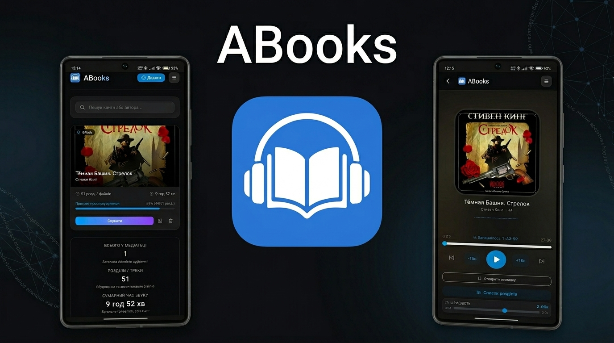

# ABooks

ABooks — це спеціалізований веб-інструмент для прослуховування аудіокниг, розроблений як прогресивний додаток для зручного доступу до вашої медіатеки безпосередньо через браузер. Система орієнтована на автономність, зберігання даних всередині пристрою та плавність взаємодії.

### Робота з джерелами та медіатекою

Додаток підтримує кілька способів формування бібліотеки:
- Імпорт аудіофайлів безпосередньо з пам'яті пристрою із завантаженням у локальну базу даних браузера.
- Підключення папок із відкритих репозиторіїв GitHub, що дозволяє транслювати книги без використання пам'яті телефону.
- Автоматичне розпізнавання метаданих, обкладинок та структури файлів.

### Можливості відтворення

Плеєр спроектований з урахуванням специфіки довгих аудіозаписів:
- Точне збереження позиції прослуховування для кожної книги окремо.
- Гнучке керування швидкістю відтворення від 0.5x до 3.0x зі збереженням тональності звуку.
- Швидка навігація за допомогою переходів на 15 секунд назад або вперед.
- Візуалізація аудіопотоку для моніторингу активності плеєра.
- Глобальна статистика медіатеки: підрахунок загальної кількості книг, треків та сумарного часу прослуховування.

### Навігація та закладки

Система дозволяє ефективно структурувати процес читання:
- Список розділів: зручне перемикання між файлами всередині однієї книги.
- Розумні закладки: створення текстових нотаток, прив'язаних до конкретного часу в розділі.
- Прогрес-бари: наочне відображення відсотка завершення кожної книги в загальному списку бібліотеки.

### Автономність та конфіденційність

ABooks працює за принципом Offline-First:
- Використання Service Worker забезпечує доступ до інтерфейсу навіть за відсутності мережі.
- Локальні аудіофайли зберігаються в IndexedDB, що гарантує їхню доступність у режимі польоту.
- Усі дані про історію прослуховування та налаштування залишаються на пристрої користувача.
- Передбачена функція створення резервної копії всієї бібліотеки в єдиний файл для перенесення на інший пристрій.

### Дизайн та комфорт

Інтерфейс адаптований для тривалого використання:
- Повноцінна підтримка темної та світлої тем для зменшення навантаження на зір.
- Оптимізована версія для мобільних пристроїв із підтримкою жестів для керування плеєром.